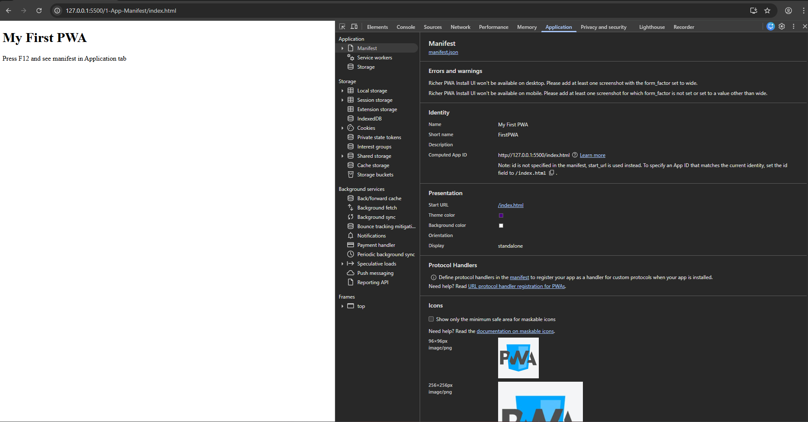
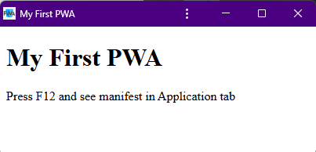

# App Manifest

คือไฟล์ json เล็กๆ ใช้อธิบายข้อมูลสำคัญของแอปพลิเคชัน เช่น ชื่อ, ไอคอน, เวอร์ชั่น, และการตั้งค่าพื้นฐาน เพื่อบอกระบบปฏิบัติการ (Android/iOS) หรือเบราว์เซอร์ (สำหรับ PWA) ทราบว่าแอปนั้นทำงานอย่างไรและแสดงผลรูปแบบใด

# การสร้าง App Manifest

1. สร้างไฟล์ manifest.json ไว้ที่ root project ของเรา
2. ระบุข้อมูลที่จำเป็นในรูปแบบ json ซึ่งประกอบด้วย name (ชื่อแอป), icons (ไอคอน), start_url (URL หน้าแรกเมื่อเปิด), display (รูปแบบการแสดงผล เช่น standalone)
3. เขียนคำสั่งเชื่อมโยงไฟล์ manifest.json เข้ากับส่วนหัว (Header) ของเว็บไซต์ เพื่อให้ทุกหน้าแสดงผลเป็นแอปได้

`<link rel="manifest" href="manifest.json" />`

# Property ที่ใช้บ่อย

- name : ชื่อเต็มของแอป (จะโชว์ตอนระบบถามว่า "คุณจะติดตั้งแอปนี้ไหม?")
- short_name : ชื่อสั้นๆ (ที่จะไปปรากฏอยู่ ใต้ไอคอน บนหน้าจอโฮมของมือถือ)
- start_url : หน้าแรกที่อยากให้แอปเปิดขึ้นมา (เช่น กดไอคอนแล้วให้เปิดไปหน้า index.html ทันที)
- display : ตั้งค่าการแสดงผล
  - fullscreen : เปิดแบบเต็มจอ ซ่อนทุกอย่าง แม้แต่แถบสถานะ (นาฬิกา, แบตเตอรี่, สัญญาณมือถือ)
  - standalone : ซ่อนแถบ URL และปุ่ม Navigation ของเบราว์เซอร์ทิ้งไป แต่ยังเหลือแถบสถานะด้านบน (นาฬิกา, แบตเตอรี่) ไว้ให้เห็น
  - minimal-ui : คล้ายกับ standalone แต่เบราว์เซอร์จะเหลือปุ่มควบคุมพื้นฐานไว้ให้จางๆ เช่น ปุ่ม Back (ย้อนกลับ) หรือปุ่ม Refresh
  - browser : มีแถบ URL มีปุ่มต่างๆ เหมือนเปิดเว็บปกติ
- background_color : สีพื้นหลังตอนที่แอปกำลังเริ่มโหลด (Splash Screen)
- theme_color : สีของแถบสถานะด้านบน ให้เป็นสีตามที่เราต้องการ (สามารถใส่ได้ทั้งรหัสสีแบบ Hex หรือชื่อสี)
- icons : รูปภาพไอคอนแอป สามารถใส่ได้หลายขนาดเพื่อแสดงได้ทั้งบนมือถือจอเล็ก จอใหญ่ หรือแท็บเล็ต

ศึกษา property อื่นๆ เพิ่มเติมได้ที่บทความ [Add a web app manifest](https://web.dev/articles/add-manifest?utm_source=devtools&utm_campaign=stable)

# Workshop

1. สร้างไฟล์ manifest.json ไว้ที่ root project
2. ระบุข้อมูลที่จำเป็นในรูปแบบ json
   `   {
"name": "My First PWA",
"short_name": "FirstPWA",
"start_url": "/index.html",
"display": "standalone",
"background_color": "#ffffff",
"theme_color": "indigo",
"icons": [
{
"src": "icon-96.png",
"sizes": "96x96",
"type": "image/png"
},
{
"src": "icon-256.png",
"sizes": "256x256",
"type": "image/png"
}
]
}`

3. เชื่อมโยงไฟล์ manifest.json เข้ากับส่วนหัว (Header) ของเว็บไซต์
   `<link rel="manifest" href="manifest.json" />`
4. เปิด Web browser inspector ขึ้นมาแล้วคลิกไปที่แท็ป _"Application"_ จะพบข้อมูลเว็บไซต์ตามที่เราได้ระบุไปใน manifest.json
   
5. สังเกตุที่แถบ url จะปรากฏไอคอน Install Web App ของเรา ให้คลิกแล้วทำการติดตั้ง
   
   
