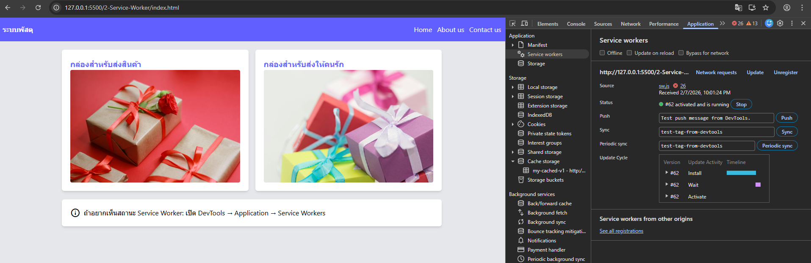

# Service Worker

Script (JavaScript) ที่ทำงานอยู่เบื้องหลัง (Background Process) ทำหน้าที่เป็น Proxy คอยดักจับการส่งข้อมูลระหว่างเบราว์เซอร์กับเซิร์ฟเวอร์ คอยตรวจสอบการเชื่อมต่อว่าเป็น **"Online"** หรือ **"Offline"** ถ้าเป็น Offline มันจะไปดึงข้อมูลจาก Cache มาให้แทนที่จะปล่อยให้หน้าเว็บแสดงเป็นหน้าเปล่าหรือ offiline

# หน้าที่ของ Service Worker

1. 📦 Cache files
   Service Worker สามารถสั่งให้เบราว์เซอร์ดาวน์โหลดและเก็บไฟล์หลักๆ (HTML, CSS, JS, รูปภาพ) ไว้ในหน่วยความจำของเครื่องผู้ใช้โดยตรง
2. 🌐 Intercept network requests
   ทุกครั้งที่เว็บมีการขอข้อมูล (Fetch) Service Worker จะคอยดักดู Requset ที่เข้ามาแล้วมันจะตัดสินใจแทนเราว่า จะปล่อยให้ไปดึงข้อมูลจาก Server ตามปกติ หรือจะไปหยิบของจาก Cache (ที่เก็บไว้ในข้อ 1) มาส่งให้แทน
3. 📴 Enable offline experience
   เมื่อมันดักฟัง (Intercept) แล้วเจอว่าตอนนี้เครื่องไม่มีอินเทอร์เน็ต มันจะดึง "หน้าเว็บสำรอง" หรือ "ข้อมูลล่าสุดที่เก็บไว้" มาโชว์ทันที ทำให้ผู้ใช้จะไม่เจอหน้า "Offline" หรือหน้าจอขาวว่างเปล่าเวลาเน็ตหลุด
4. 🔄 Background Sync
   การทำงานเบื้องหลัง เช่น ถ้าผู้ใช้กด "บันทึกข้อมูล" แล้วเกิดเน็ตหลุดหรือมีปัญหาเกี่ยวกับการเชื่อมต่อกับ network ตัว Service Worker จะเก็บงานนั้นไว้ในคิว (Queue) มันจะคอยเฝ้าดูจนกว่าระบบจะกลับมาใช้งานได้ แล้วค่อยแอบส่งข้อมูลนั้นขึ้นเซิร์ฟเวอร์ให้เอง โดยที่ผู้ใช้ไม่ต้องเปิดหน้าเว็บค้างไว้
5. 🔔 Push Notifications
   Service Worker สามารถรับข้อมูลจากเซิร์ฟเวอร์แล้วแสดงเป็น "ข้อความแจ้งเตือน" บนหน้าจอมือถือหรือคอมพิวเตอร์ได้ แม้ว่าตอนนั้นจะปิดเบราว์เซอร์ไปแล้วก็ตาม
6. 🌎 Tell Browser Installable Mode
   Service Worker คือตัวที่ใช้บอกให้ Google Chrome และเบราว์เซอร์อื่นๆ ทราบว่าเว็บไซตืนี้สามารถติดตั้งได้

# Service Worker Lifecycle

1. Register
   ขั้นตอนนี้จะเป็นการลงทะเบียนใช้งาน Service Worker ทำให้ Web Browser ทราบว่าเว็บไซต์นี้จะมีการใช้งาน Service Worker
2. Install
   ขั้นตอนนี้มักจะถูกใช้เพื่อ Caching จะทำการโหลดไฟล์ HTML, CSS, JS, Resource หลักๆ มาเก็บไว้ในเครื่อง เมื่อทุกอย่าง cache ไว้สมบูรณ์หมดแล้ว ก็แปลว่า Service Worker ได้ Install เสร็จหมดแล้ว แต่ถ้าหาก cache ไม่สำเร็จหรือไม่สมบูรณ์ก็เท่ากับว่าเป็นการ Install ไม่สำเร็จไปด้วย
3. Activate
   ขั้นตอนนี้จะทำการ Clear cache เก่าๆ ทิ้งหรือจัดการ Service เวอร์ชันก่อนหน้าออกไปก่อน จากนั้นจะเอา service ตัวใหม่มา handle และ manage cache
4. Fetch
   เมื่อผ่าน 3 ขั้นตอนแรกมาแล้ว Service Worker จะอยู่ในสถานะทำงาน(Idle) จะคอยดักฟังเหตุการณ์ต่างๆ โดยเฉพาะการขอข้อมูล ทุกครั้งที่หน้าเว็บมีการโหลดรูปภาพหรือเรียก API ตัว Service Worker จะดักจับคำขอนั้น (Fetch Event) มันจะตัดสินใจว่า "จะไปเอาข้อมูลจาก Server" หรือ "จะเอาข้อมูลจาก Cache ที่เก็บไว้" มาแสดงบนหน้าเว็บ

# Workshop

1. เริ่มต้นเราต้องทำการ Register Service Worker เข้าไปที่หน้าเว็บเพจของเราก่อน ให้ทำการเปิดไฟล์ index.html แล้วเพิ่ม script เข้าไป

```
<script>
   // Register Service Worker
   if ("serviceWorker" in navigator) {
      window.addEventListener("load", async () => {
         try {
            const reg = await navigator.serviceWorker.register("./sw.js");
            console.log("SW registered:", reg.scope);
         } catch (err) {
            console.warn("SW registration failed:", err);
         }
      });
   }
</script>
```

2. สร้างไฟล์ sw.js เพื่อกำหนดเงื่อนไขการทำงานของ Service Worker ในขั้นตอน Install, Activate และ Fetch สำหรับควบคุมแอปพลิเคชัน

```
// Simple offline navigation for 3 static pages

const CACHE_NAME = "my-cached-v1";

// เราจะ precache หน้าเพจ,CDN และ resource ต่างๆที่จำเป็น เพื่อให้การทำงานใน mode offline แล้วยังสามารถใช้งานได้
const PRECACHE_URLS = ["/", "index.html"];

//Install
self.addEventListener("install", (event) => {
  event.waitUntil(
    (async () => {
      const cache = await caches.open(CACHE_NAME);
      // addAll จะพยายาม cache ทุก URL
      // ถ้า CDN บางอัน fail ก็ยังมี local pages (ถ้าอยาก strict ให้แยก try/catch)
      await cache.addAll(PRECACHE_URLS);
    })(),
  );

  self.skipWaiting();
});

//Activate
self.addEventListener("activate", (event) => {
  event.waitUntil(
    (async () => {
      const keys = await caches.keys();
      await Promise.all(keys.filter((k) => k !== CACHE_NAME).map((k) => caches.delete(k)));
      await self.clients.claim();
    })(),
  );
});

//Fetch
// Offline navigation:
// - ถ้าเป็น "เปิดหน้า" (navigate) ให้ตอบจาก cache ก่อน

self.addEventListener("fetch", async (event) => {
  const req = event.request;

  if (req.mode === "navigate") {
    console.log("Handling navigation request for", req);
    event.respondWith(
      (async () => {
        const cached = await caches.match(req);
        return cached;

      })(),
    );
    return;
  }

  // Static assets: cache-first
  event.respondWith(
    (async () => {
      const cached = await caches.match(req);
      if (cached) return cached;

      try {
        const fresh = await fetch(req);
        // เก็บเฉพาะ response ที่ปกติ
        const cache = await caches.open(CACHE_NAME);
        cache.put(req, fresh.clone());
        return fresh;
      } catch (e) {
        // ถ้าเป็น resource อื่น ๆ แล้ว offline จริง ๆ ก็ปล่อยไป
        return cached;
      }
    })(),
  );
});
```

3. เปิด Web browser inspector ขึ้นมาแล้วคลิกไปที่แท็ป _"Application"_ ดูที่หัวข้อ _"Service Worker"_ จะพบว่าได้มี service ที่เราขียนถูก register แล้ว
   
4. จากนั้นลองดูที่หัวข้อ _"Cache storage"_ จะมีข้อมูลที่เราได้ cached ไว้
   
